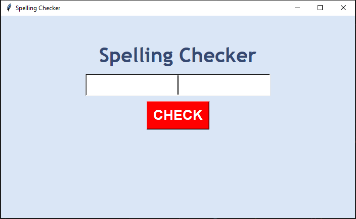

# Spelling Checker Application

This **Spelling Checker** application is built using **Tkinter** for the graphical user interface (GUI) and **TextBlob** for performing text correction. It allows users to check the spelling of any word or phrase and provides the corrected version using natural language processing.

## 🚀 Features

- 🎨 **User-friendly GUI**: Created using Tkinter for an easy-to-use interface.
- 🔍 **Spelling Correction**: Automatically corrects the spelling of words and phrases.
- 💡 **Real-time Feedback**: Displays the corrected text immediately after the user inputs the word.

## ⚙️ Requirements

- Python 3.x
- Tkinter (usually pre-installed with Python)
- TextBlob (`pip install textblob`)

## 🔧 Installation

1. Clone the repository:

    ```bash
    git clone https://github.com/mian-arham-haroon/spelling-checker.git
    ```

2. Install the required libraries:

    ```bash
    pip install textblob
    ```

3. Run the application:

    ```bash
    python spelling_checker.py
    ```

## 🖼️ Screenshot

Below is a preview of the application's interface:



## 💡 Optional Enhancements

- **Real-time spell-checking**: Provide suggestions as the user types.
- **Multilingual support**: Extend support to multiple languages for spelling checks.

📌 **Conclusion**: This project is a great starting point for beginners to explore natural language processing (NLP) and GUI development in Python.
